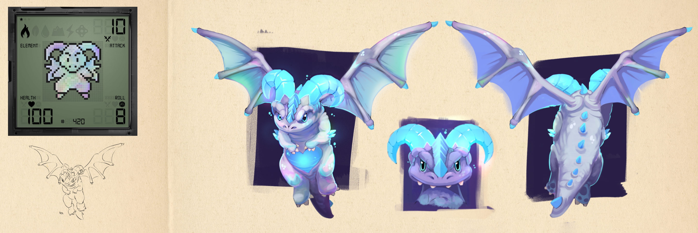
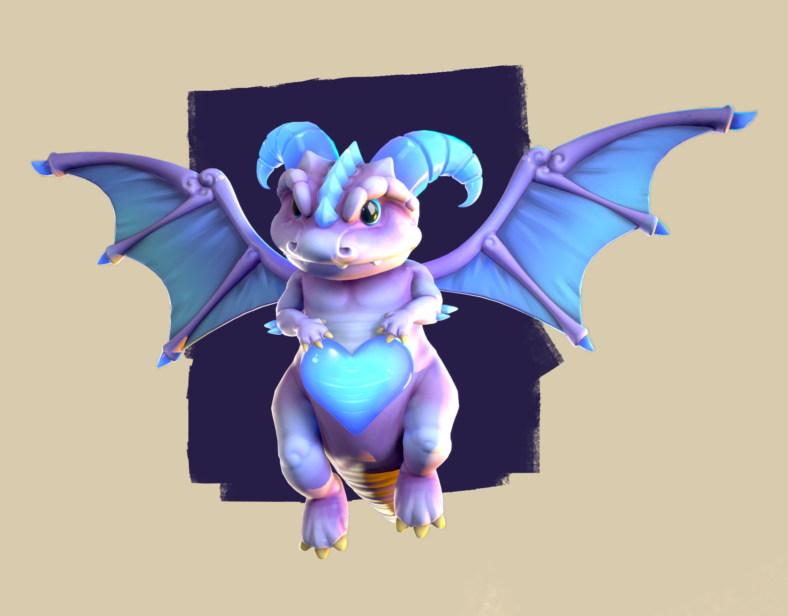
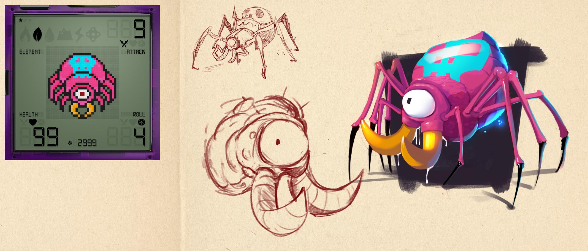
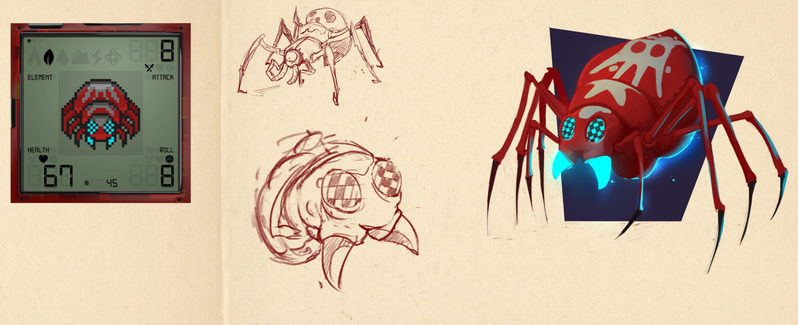
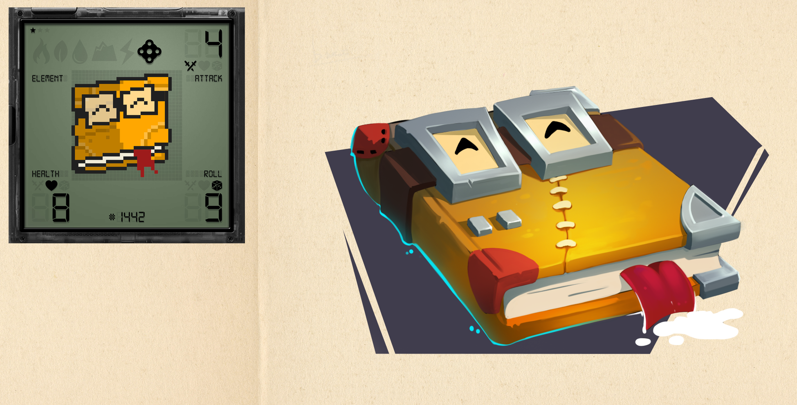
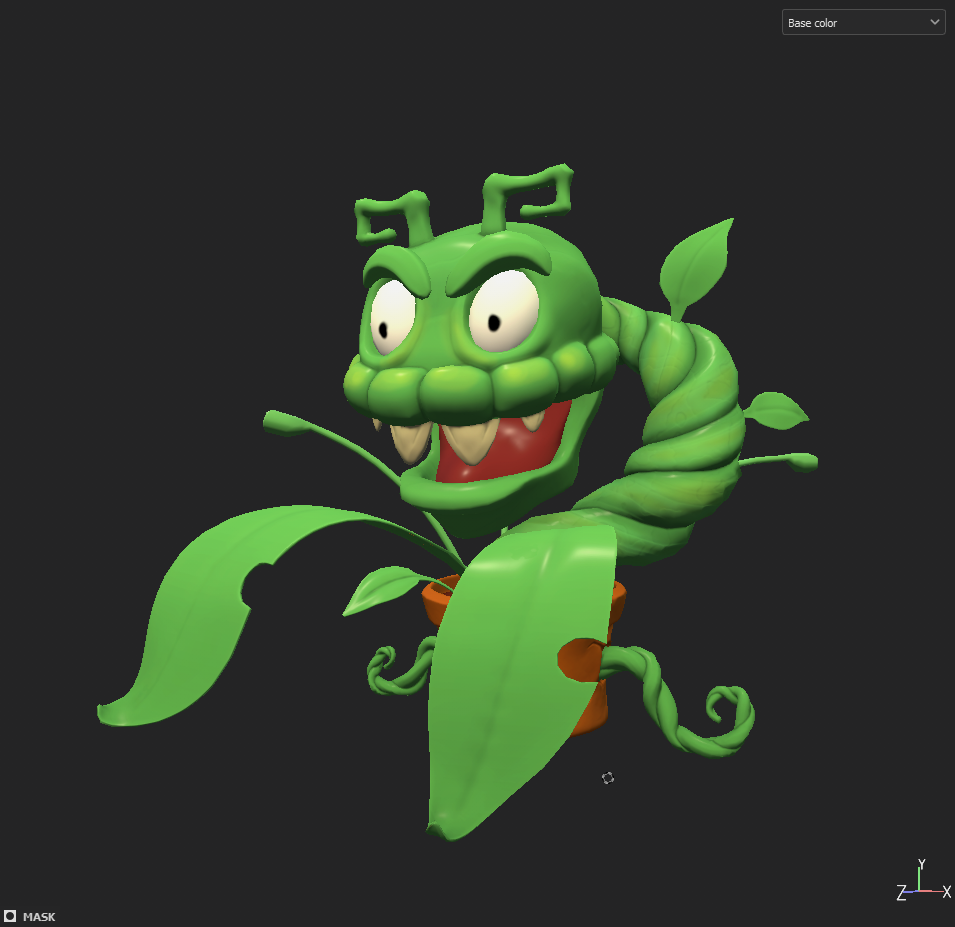
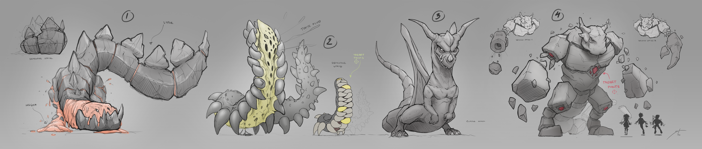
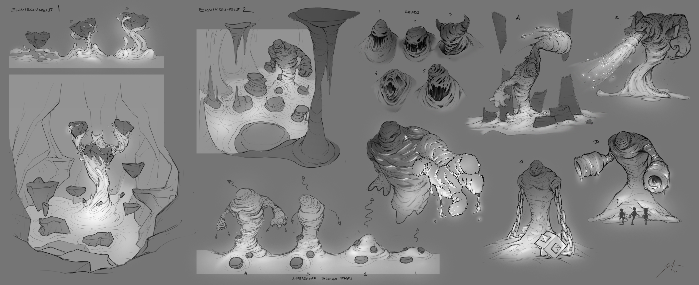
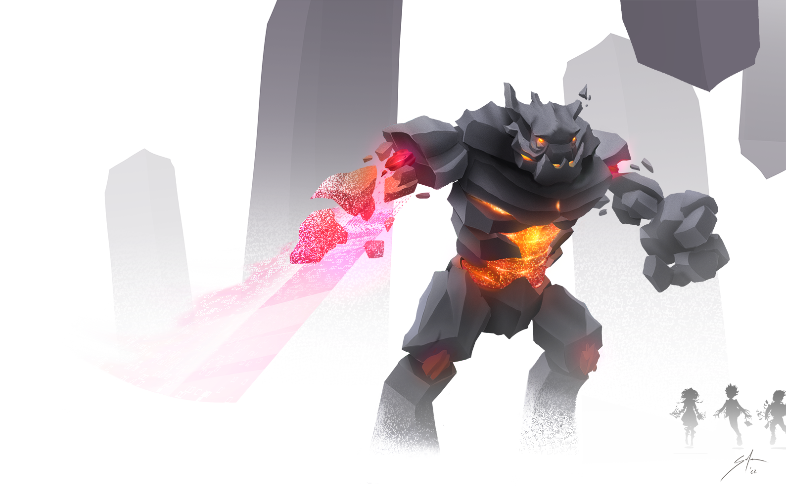
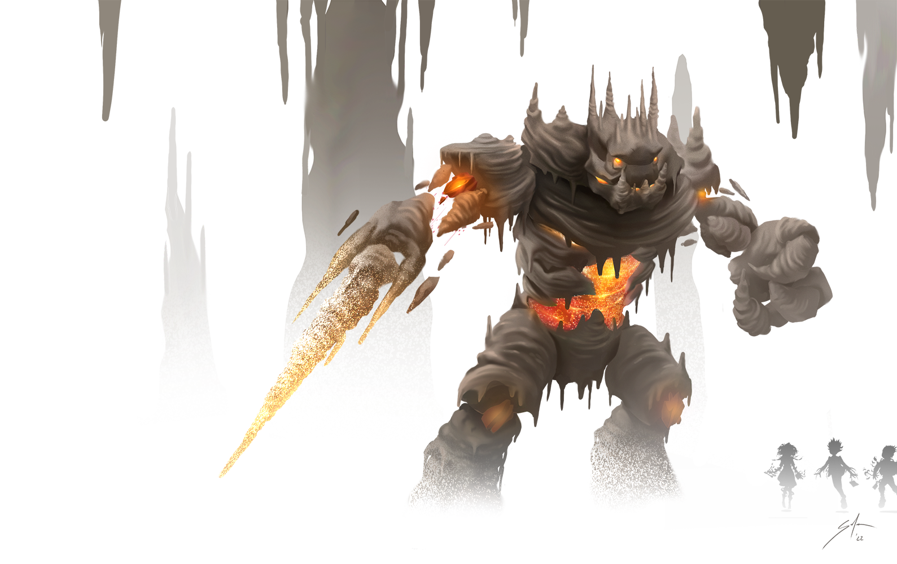

# Concept Art

<figure><figcaption></figcaption></figure>

### Monsters

    .png>) .png>)

.png>)

.png>) 

<figure><figcaption></figcaption></figure>

### Character development

<figure><figcaption>
Concept art for upcoming teaser trailer
</figcaption></figure>

<figure><figcaption>
Story Development Poster
</figcaption></figure>

<figure><figcaption></figcaption></figure>

### Boss Concepts

<figure><figcaption></figcaption></figure> <figure><figcaption></figcaption></figure>

<figure><figcaption></figcaption></figure> <figure><figcaption></figcaption></figure>

<figure><figcaption></figcaption></figure>
