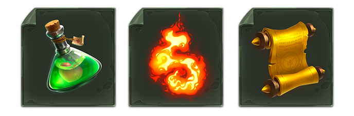
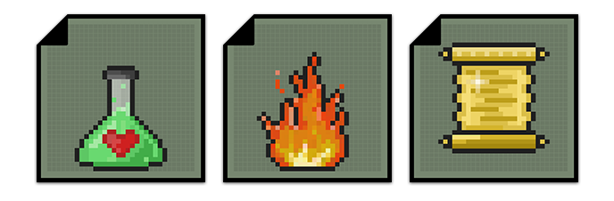

# Abilities (Files)

### **What are \[Files]?**

`[Files]` were initially created by the developers at **MetaToys Inc**. to endow _Token Monsters_ with powerful buffs and skills to boost them in combat. As our story unfolds, new file-types are introduced to assist players in challenging Dungeons, embarking on quests or flexing new cosmetic rewards.

`[Files]` are organized into four main categories: **Upgrades, Repairs, Power-ups** and **Viruses**. You can also obtain Cosmetic `[Files]` which are used outside of battle and are always active. Players will hold all their `[Files]` in a personal _<mark style="color:blue;">**Hard Drive**</mark>_ which will act as an ability index, allowing players to add or remove `[Files]` from their action bar.

### **\[File] Rarities**

All `[Files]` can come in four rarities types; <mark style="color:green;">**Uncommon**</mark>, <mark style="color:blue;">**Rare**</mark>, <mark style="color:purple;">**Epic**</mark>, and <mark style="color:orange;">**Legendary**</mark>. Rarer `[Files]` will be more valuable to the player base as they will either provide greater utility or will represent harder to obtain cosmetics.

### **Using \[Files] in Battle**

Players will choose from among the `[Files]` within their _<mark style="color:blue;">**Hard Drive**</mark>_ (_ability index_) to upload a maximum of five files from each category of abilities onto their action bar. The effects of `[Files]` can be combined to create more powerful attacks, such as using one file to boost the damage of another. In addition to using `[Files]` offensively, players can also use `[Files]` defensively to protect their monster or counter enemy attacks.


_**Note:**_ Some ability Files will be extremely powerful when combined with other types. We are counting on the community to create undiscovered meta-plays and combos!




### Upgrades (buffs)

**Upgrade file examples:**

* <mark style="color:green;">**`[.mihu]`**</mark>(_Minor Health Upgrade_) - Buff an individual monster to increase its health by **15** for 10 min.
* <mark style="color:blue;">**`[.mahu]`**</mark>(_Major Health Upgrade_) - Buff an individual monster to increase its health by **25** for 20 min.
* <mark style="color:blue;">**`[.rsb]`**</mark>(_Reset Button_) - Resets the cooldown of an ability of your choice.
* <mark style="color:purple;">**`[.imm]`**</mark> (_Immunity scroll_) - Prevents your monster from being deleted (killed) from a fatal attack and provides a protective buff making it invulnerable for for 5 sec.
* <mark style="color:purple;">**`[.roar]`**</mark>(_Primal Roar_) - Your monster roars ferociously, increasing its max health by X for **10-15 seconds**, (_X being the value difference between your attack and the enemy monsters’ attack, x3_)**.**



### Repairs (potions)

_<mark style="color:red;">(Permanently deleted after use)</mark>_

**Repair file examples:**

* <mark style="color:green;">**`[.mihr]`**</mark>(_Minor Health Repair_) - Repair **10** of your total health instantly.
* <mark style="color:blue;">**`[.mahr]`**</mark>(_Major Health Repair_) - Repair **25** of your total health instantly.
* <mark style="color:green;">**`[.mipt]`**</mark>(_Minor Protection Shield_) - Shields your monster, absorbing **15** damage.
* <mark style="color:blue;">**`[.mapt]`**</mark>(_Major Protection Shield_) - Shields your monster, absorbing **35** damage.



### Power-ups (elixirs)

**Power-Up file examples:**

* <mark style="color:blue;">**`[.miab]`**</mark>(_Minor Attack Boost_) - Multiply attack value by **2** for for 10 seconds.
* <mark style="color:purple;">**`[.maab]`**</mark>(_Major Attack Boost_) - Multiply attack value by **4** for 15 seconds.
* <mark style="color:purple;">**`[.vbst]`**</mark>(_Virus Boost_) - Doubles the duration of your virus effects.
* <mark style="color:orange;">**`[.vbstmx]`**</mark>(_Virus Boost Maximum_) - Refreshes the duration of all Virus effects.



### Viruses (abilities)

**Examples of element specific \[Files]:**&#x20;

* <mark style="color:purple;">**`[.burn]`**</mark>(_Burn_) (_<mark style="color:red;">Fire</mark>_) - Adds a burn virus to the enemy monster causing them to take an 1-3 damage over 1-3 seconds (_or until removed_).
* <mark style="color:purple;">**`[.shock]`**</mark>(_Static Shock_) (_<mark style="color:yellow;">Electric</mark>_) - Stuns the enemy monster for 1-3 seconds.
* <mark style="color:purple;">**`[.avrs]`**</mark>(_Anti-virus_) (_<mark style="color:yellow;">Electric</mark>_) - Removes an enemy virus effect from a friendly player.
* <mark style="color:purple;">**\[**</mark><mark style="color:purple;">**`.poisn]`**</mark>(_Nature’s Poison_) (_<mark style="color:green;">Nature</mark>_) - Decrease the enemy monster’s maximum health by X for 5-10 seconds, (X being the value difference between your attack and the enemy monsters’ attack, x3).
* <mark style="color:purple;">**`[.phr]`**</mark>(_Periodic Health Repair_) (_<mark style="color:green;">Nature</mark>_)- Heals a friendly monster for 5/10/15 health every 3-5 seconds.
* <mark style="color:purple;">**`[.wdmg]`**</mark>(_Water Damage_) (_<mark style="color:blue;">Aqua</mark>_) - Adds a short circuit debuff to the enemy monster after being attacked, lowering their base attack by 1-3 for 5-10 seconds or until removed.
* <mark style="color:purple;">**`[.swrp]`**</mark>(_Swift Repair_) (_<mark style="color:blue;">Aqua</mark>_) - Instantly heal a friendly monster for 10/20/30 health.
* <mark style="color:purple;">**`[.ret]`**</mark>(_Retaliation_) (_<mark style="color:orange;">Earth</mark>_) - After being attacked, retaliate the total damage taken back to the enemy monster, split over 2-6 seconds (_You still take damage from the enemy attack_).
* <mark style="color:purple;">**`[.dscmb]`**</mark>(_Discombobulate_) (_<mark style="color:purple;">Magic</mark>_) - Randomly swaps element types of all monsters in battle for 10 seconds. (_element vulnerabilities will adjust accordingly_).
* <mark style="color:purple;">**\[**</mark><mark style="color:purple;">**`.hack]`**</mark>(_Hack_) (_<mark style="color:purple;">Magic</mark>_) - Steals an Upgrade buff from the enemy monster and applies it to your monster.&#x20;

**Examples of non-element specific \[Files]:**&#x20;

* <mark style="color:purple;">**`[.dg]`**</mark>(_Downgrade_) - Remove an active Upgrade from the enemy player.
* <mark style="color:orange;">**`[.mdg]`**</mark>(_Mass Downgrade_) - Remove an active Upgrade from all enemy players (if the enemy player has multiple buffs, \[.mdg] will prioritize removing the most recent buff.
* <mark style="color:purple;">**`[.fwall]`**</mark>(_Firewall_) - After being attacked, Firewall will activate, causing the attack to reflect back to the enemy monster. (You do not take damage from the attack).
* <mark style="color:purple;">**\[**</mark><mark style="color:purple;">**`.dup]`**</mark>(_Duplicate_) - Duplicates the effect of a Repair File you activated within the last 30 seconds.



<figure><figcaption></figcaption></figure>

### Monster Cosmetic Files

**Cosmetic Files** can be obtained through participation in various in-game activities and are stored in your <mark style="color:purple;">Cosmetic Folder</mark>.&#x20;

**Some items include:**



* <mark style="color:yellow;">**`[.fdst]`**</mark>**(**_**Fairy dust**_**)** - Engulfs your monster in fairy dust, causing it to sparkle and shine during battle.
* <mark style="color:yellow;">**`[.sprz]`**</mark>**(**_**Supersize**_**)** - Doubles the size of your monster, giving it a more intimidating presence!
* <mark style="color:yellow;">**`[.shrink]`**</mark>(_**Shrink**_**)** - Reduces your monster's size by half.



<figure><figcaption></figcaption></figure>

### Dungeon and Boss Files

**Dungeon and Boss Files** can be obtained as rewards for defeating Dungeons. These Files will be used exclusively by Dungeon owners and can play a prominent role in escalating the challenge posed by the Dungeon.&#x20;

**Some items include:**



The bosses at the end of each dungeon (_owned by the Dungeon owner_) will have 2 ability slots. You can fill these slots with **Boss Ability Files**.&#x20;

**Some examples include:**

* <mark style="color:orange;">**`[.fstorm]`**</mark> (_Firestorm_) (_<mark style="color:red;">Fire</mark>_) - Rain AOE fire damage on all enemies for 10 damage (20 second cooldown).
* <mark style="color:orange;">**`[.gslm]`**</mark> (_Ground Slam_) - Slams the ground, causing enemies to be stunned for 3 seconds (15 second cooldown).



**Dungeon Add-on Files** are files which can be used by Dungeon owners to enable environmental (negative and positive) effects which are active throughout the Dungeon or during battle (_depending on the file_). These Add-Ons dramatically increase the difficulty of Dungeons and make the experience feel different each time you engage!

**Some examples include:**

* <mark style="color:orange;">**`[.fwarm]`**</mark> (_Fiery Warmth_) (_<mark style="color:red;">**Fire**</mark>_) - All Fire Monsters in the dungeon have increased fire damage +3.&#x20;
* <mark style="color:orange;">**`[.cshift]`**</mark> (_Cosmic Shift_) (_<mark style="color:purple;">**Magic**</mark>_) - Shifts the health of two random enemy monsters for 10 seconds. Will occur every 30 seconds.
* <mark style="color:orange;">**`[.rocks]`**</mark> (_Rock Slide_) (_<mark style="color:orange;">**Earth**</mark>_) - Randomly stuns a monster (either challengers or defenders) for 3 seconds, every 15 seconds.
* <mark style="color:orange;">**`[.disable]`**</mark> (_Disable_) - Disables enemies from using repair Files for 10 seconds (1 min internal cooldown).



**Cosmetic Dungeon/Boss Files** will allow Dungeon owners to change the look and feel of their Dungeon and their boss!

**Some examples include:**

* <mark style="color:purple;">**`[.bflame]`**</mark> (_Blue Flame_) - Change all fire effects to create blue fire instead of red.
* <mark style="color:purple;">**`[.swag]`**</mark> (_Swag Glasses_) - Gives your final boss swag glasses!


