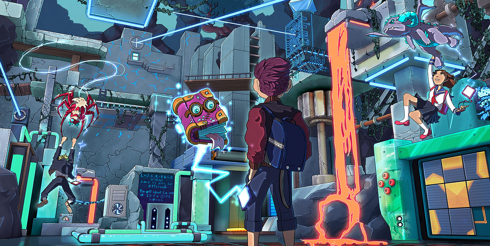
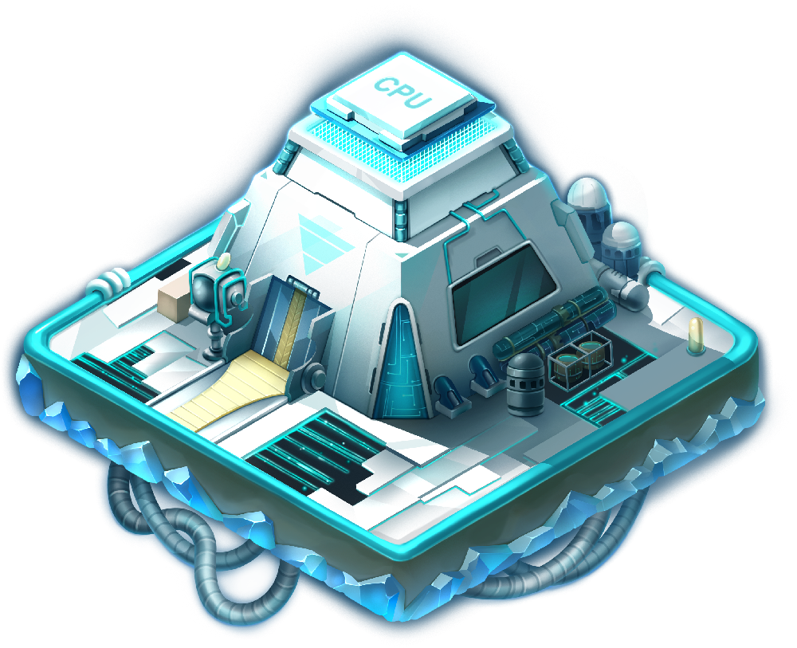

# Dungeons

### What are Dungeons?

Tokun Monsuta will feature multiplayer platform Dungeons where players will team up to solve puzzles, defeat staked monsters and bosses and discover hidden treasures. Players will travel an interactive landscape, utilizing their monsters’ abilities such as _gliding_, _grappling_, _gripping_ players to new platforms, _air dashing, leaping_, and others. Each of our **52 subspecies** will have their own unique active and passive abilities, allowing each monster to bring distinct advantages to every dungeon team. With dozens of dungeon levels and hundreds of puzzles to solve, players will need to rely on their collective experience to master every dungeon variation they encounter.

In addition to completing platform puzzles, players will engage in battle against staked monsters in a dynamic live action combat system. Players can choose between three different talent specializations and an arsenal of hundreds of unique abilities (`Files`) to craft their monster's specific combat style Staked monsters will be controlled by an intelligent _**Dungeon A.I.**_, which dynamically learns and adapts to evolving metas, providing seasoned Dungeon owners with a growing advantage. Dungeons play a critical role in highlighting the power and creativity that only _blockchain technology_ can showcase in an open world action-adventure experience.

### **How do Dungeons work?**

Players will have the option to purchase Dungeons (_digital property_) within Tokun Monsuta. Each Dungeon contains 3 staking slots reserved for monsters. Dungeon owners can choose how to go about filling these slots, either with their own monsters or with the help of the community. Once a Dungeon is staked, it cannot be removed until the end of its staking period. In order to clear the Dungeon, players must first defeat the staked monsters who serve as a front line defense before the _**final boss**_.

Dungeon owners will earn <mark style="color:purple;">`$Code`</mark>, <mark style="color:orange;">`Tokun`</mark> and exclusive Cosmetic Files for staking each month. Dungeon owners can earn more Tokun by filling all staking slots with monsters of their own. Dungeon owners who stake for a period of three consecutive months will be able to earn exclusive Cosmetic Files which they can use or sell on our real-money Marketplace.

### Dungeon Lore

**Dungeons** represent a new age of cyber security in a world forever changed by the discovery of <mark style="color:green;">Denshi</mark> and the introduction of <mark style="color:purple;">`$Code`</mark>. New protagonists emerge from the shadows, seeking to wield the power of $Code to carve out their seat in the hierarchy of power.

Among these figures is a mysterious hacker who is enraged at the sale of <mark style="color:green;">Denshi</mark> creatures by **Meta Toys Inc**. Believing that consoles are nothing more than glorified prisons, the hacker launches a widespread cyber attack upon large financial institutions linked to Meta Toys. The hack appears to have been carried out by a new-age smart contract, developed with the use of <mark style="color:purple;">`$Code`</mark>. The attack effortlessly bypasses the most advanced security systems in the world, disarming them and proving them to be ineffective. Having gained access, the hacker quickly drains large crypto vaults of all their liquidity and disseminates classified information detailing how the techno-elites have been spying on the public and manipulating their behaviors. This attack is followed by dozens of similar ones across the globe, targeting strongholds of wealth and secrets. With billions of dollars erased and the public in uproar, a _**dependable expert**_ is summoned to develop a new technological defense system to secure the assets and confidential data of the elite.

**Satoshi Inc.**, the world’s foremost cyber security firm, is contracted to develop the new defense system. Having carefully examined and analyzed the breaches, the experts conclude that the hacker originated from <mark style="color:green;">Denshi</mark> and was fluent in the use of <mark style="color:purple;">`$Code`</mark>. Although the identity of the hacker remains to be determined, what is indisputable is the devastating power of <mark style="color:purple;">`$Code`</mark> users. To combat this threat, the engineers at Satoshi develop a revolutionary virtual reality smart contract, codenamed “_**Project Dungeon**_''. This new security contract is programmed to detect unauthorized users and deploy a vault transfer of crypto funds and classified information to a new server. Because the vault is vulnerable during the transfer, the contract is programmed to delay the hacker long enough for the transfer to finalize. It achieves this by constructing a virtual puzzle landscape which the hacker must traverse through and solve. As a second line of defense, the contract is equipped with Meta Toys’ console technology, enabling it to stake _**Token Monsters**_ to fight against would-be hackers. The CEO of Satoshi, however, was not content, recognizing the potential for <mark style="color:purple;">`$Code`</mark> users to bypass even the most advanced security systems. A failsafe measure was necessary in the event a hack was successful in defeating the first two stages of the Dungeon program. The engineers at Satoshi developed a novel creature of rare might, constructed from splicing the metadata of a Token Monster and a Denshi creature with sentient capabilities. By combining opposing forces, the engineers developed an unstable abomination, instinctually battling the commands of the Dungeon program in an effort to restore itself back to its original state. This dangerous boss monster was incarcerated in the depths of the Dungeon program as a last desperate defense of the crypto vaults.



Each **Dungeon** will have its own element theme, allowing Dungeon owners to use unique _element specific_ abilities and \[`Files`]. Each Dungeon boss will be equipped with two Ability `File` slots which Dungeon owners can utilize to empower their defenses. Dungeons can also have up to three <mark style="color:blue;">**Add-ons**</mark>, providing Dungeon-wide mechanics that further improve its defense. Dungeon owners will want to obtain Add-ons and <mark style="color:blue;">**Boss Ability Files**</mark> (_powerful files that are extremely rare and only obtainable by defeating higher level dungeons or through staking_) in order to strengthen their Dungeon and protect their vault from being depleted!&#x20;


You can find out more information about Boss `Files` in the File section of our whitepaper.




<strong>Perks to </strong><em><strong>challenging</strong></em><strong> a Dungeon</strong>

* **Earning Tokun and Files (Our in-game currency) -** Players who defeat Dungeons will earn <mark style="color:orange;">`Tokun`</mark>, which will be taken from the Dungeon Vault until the resources have been completely depleted. Players can also earn _exclusive_ in-game rewards (`Files`) for successfully defeating a Dungeon.
* **Leaderboards -** Players who successfully defeat Dungeons will be placed on a leaderboard which will track their win/loss ratio for the week. Players who place in the top bracket of the Dungeon leaderboard will earn rare in-game Files that will support them in their Dungeon conquest. In addition, players will also earn <mark style="color:purple;">`$Code`</mark> and <mark style="color:orange;">`Tokun`</mark>.

<strong>Perks to </strong><em><strong>owning</strong></em><strong> a Dungeon</strong>

* **Limited Dungeons** - Since only a limited number of Dungeons will be available for purchase, these in-game assets are scarce and costly. Furthermore, they are very likely to substantially increase in value over time.
* **Earning&#x20;**<mark style="color:purple;">**`$Code`**</mark>**&#x20;(Our DAO / Utility token)** - Dungeon owners who have staked their dungeons will passively earn <mark style="color:purple;">`$Code`</mark> during the distribution period prior to the launch of the game. After launch, <mark style="color:purple;">`$Code`</mark> will act as a **DAO** (_Decentralized Autonomous Organization_) token for early investors and will provide additional in-game utility to all holders.
* **Earning&#x20;**<mark style="color:orange;">**`Tokun`**</mark>**&#x20;(**_**Our in-game currency**_**)** - As explained above, Dungeon owners will passively earn <mark style="color:orange;">`Tokun`</mark> during the period prior to the launch of the game. After launch, Dungeon owners will earn more Tokun each week for having their Dungeon fully staked (_activated_) as the supply of <mark style="color:purple;">`$Code`</mark> moves closer to its allotted cap.

<strong>Perks to </strong><em><strong>staking</strong></em><strong> in a Dungeon</strong>

* **Earning&#x20;**<mark style="color:purple;">**`$Code`**</mark>**&#x20;(**_**Our DAO / Utility token**_**)** - With only _3 staking slots_ per dungeon available to the player base, players will compete with one another to fill these limited slots in order to passively earn <mark style="color:purple;">`$Code`</mark> during the distribution period.
* **Earning&#x20;**<mark style="color:orange;">**`Tokun`**</mark> _**(Our in-game currency)**_ - After the launch of the game, players will passively earn <mark style="color:orange;">`Tokun`</mark> each week for staking their monsters in Dungeons.

