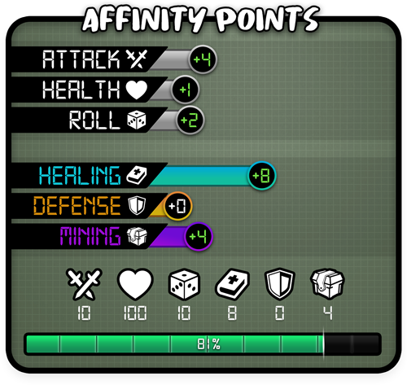

# Affinity System

<mark style="color:blue;">**Tokun Monsuta**</mark> will allow players to increase their monster’s stats (_Health, Attack, Roll, Healing, Defense and Mining_) by earning _Affinity Points_. The _**Affinity System**_ allows players to earn and spend Affinity Points as they progress through the game and bond with their creature. The more Affinity Points you spend, the stronger your monster will be and the better equipped you will be to take on new challenges. Once you have reached `maximum base stats` (_100 health, 10 attack and 10 roll_) you will be able to start spending your Affinity Points to improve Bonus stats (<mark style="color:blue;">**Healing**</mark>, <mark style="color:orange;">**Defense**</mark> and <mark style="color:purple;">**Mining**</mark>).

The Affinity System was created to allow players to increase their creature’s power and skills by capitalizing on the time they invest into playing with them. It also gives players who have minted lower base stat monsters the opportunity to upgrade their monsters’ powers in order to be more competitive.

When a monster is sold and transferred to a new player, it will only retain 50% of its earned affinity points above the value it was minted at. If the monster is below max base stats, it will retain any stat boost the player earned when it is transferred to the new owner. This permits players to use their gaming time to power up their creature while affording them power to increase profit as the monster rises in value in the Marketplace.
