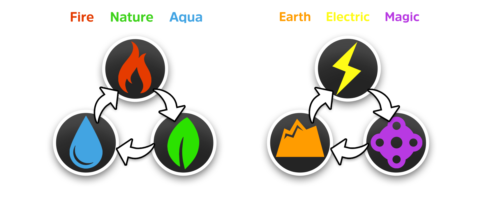

# Elemental Specialization

<figure><figcaption>
Here shows a diagram of the element strengths and weaknesses
</figcaption></figure>

Each Element has its own _unique characteristics and advantages_ within Tokun Monsuta. The element of your monster is determined during the minting process, and is one of the key factors affecting its role and power level.&#x20;

**Some examples of Element specific roles are:**



<mark style="color:red;">**Fire:**</mark> specializing in single target, burst, and damage over time spells (DOTS)\
<mark style="color:yellow;">**Electric:**</mark> specializing in area of effect (AOE) damage and crowd control (CC).



<mark style="color:blue;">**Aqua**</mark>**:** specializing in direct healing and shielding.\
<mark style="color:green;">**Nature**</mark>**:** specializing in healing over time (HOTS) and cleansing debuffs.


_(both will be able to to AOE heal in their respective specializations)_




<mark style="color:orange;">**Earth:**</mark> Specializing in mitigating damage for the team.



<mark style="color:purple;">**Magic:**</mark> specializing in creating chaos, debuffing enemy players, buffing friendly players and providing other various utility buffs.



**Some key facts about the elements within Tokun Monsuta include:**

* Every element has it's own `[File]` type which is exclusive to each element, such as <mark style="color:purple;">**`[.burn]`**</mark> for <mark style="color:red;">Fire</mark> element monsters.
* Each element has a unique weakness to another element, which causes it to suffer increased damage from its attacks. An example of this is Fire element monsters attacking Nature Element monsters. In PVP battle, this weakness is decreased significantly to allow for a fairer balance of competition.


_**We are excited to see what combinations and metas the player base will think up!**_

