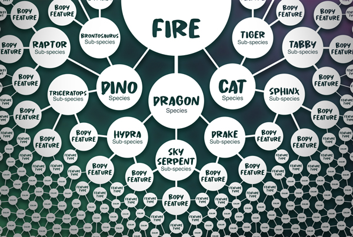

# Species & Abilties

Each token monster originated as a creature of <mark style="color:green;">**Denshi**</mark>, born from the _memories of the Architects_. During the mint, Tokun Monsuta will release _**5,000 unique First Edition (1-star) monsters**_, consisting of _18 different species_ and _54 different subspecies_. Each subspecies will have its own unique active and passive abilities within the game, offering a vast diversity of gameplay. Players will want to collect different subspecies to expand their arsenal of player abilities in order to take on more demanding challenges for greater rewards.

**Some examples of abilities include:**

<table data-header-hidden><thead><tr><th width="164.43712992305507" align="center">Subspecies</th><th width="150" align="center">Active Ability</th><th align="center">Active Ability Details</th></tr></thead><tbody><tr><td align="center"><strong>SUBSPECIES</strong></td><td align="center"><strong>ACTIVE ABILITY</strong></td><td align="center"><strong>DETAILS</strong></td></tr><tr><td align="center">Drake</td><td align="center">Glide</td><td align="center">Jumps in the air and activates the ability to glide to a new location.</td></tr><tr><td align="center">Battery</td><td align="center">Stun Shock</td><td align="center">Sends a lightning bolt down to a targeted area, stunning all enemies in the radius of the blast.</td></tr><tr><td align="center">Spellbook</td><td align="center">Teleport</td><td align="center">Teleports to a location up to 20 yards away.</td></tr></tbody></table>
