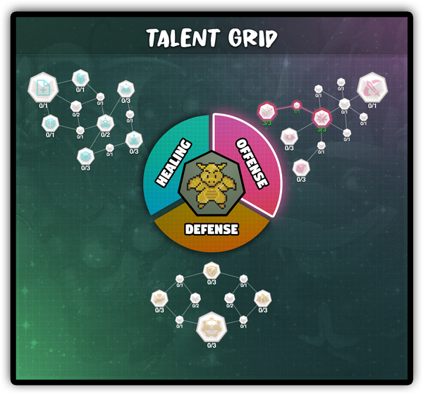

# Talent Grid

Once players power up their monster past max base stats they will begin to earn _**Talent Points**_ while continuing to earn Affinity Points. Talent Points can be used in the **Talent Grid** to specialize your monster in the following roles; _Offense, Defense or Healing_.

Some players will want to take a balanced approach to their Talent Grid if they plan to engage in all game modes, while others interested in taking on the toughest team-based activities will choose to specialize in dedicated roles.

We expect the community to create a wide range of unique and powerful grids that best suit various team compositions and activities within the game. We can’t wait to see what you come up with!
