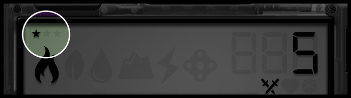
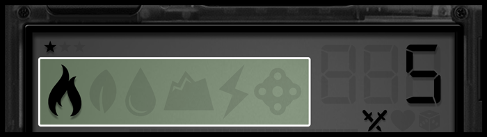
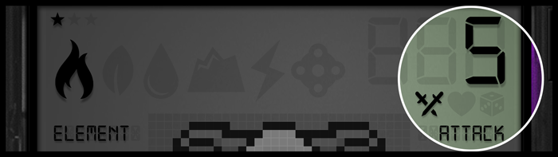
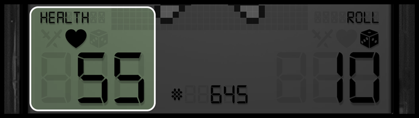
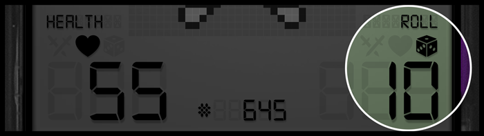

# The Console

<figure><figcaption>
Available in 8 different colors
</figcaption></figure>

**The Console** is a digital device that connects our world to the digital world of <mark style="color:green;">**Denshi**</mark>. It is home to the creatures of <mark style="color:blue;">**Tokun Monsuta**</mark> that have journeyed to our world. When you mint your own monster, he will travel directly from Denshi to your private device. Your monster is one of a kind and is uniquely linked to your character’s progress. Think of him as your personal gladiator. He is endowed with a set of key qualities, all of which you will find displayed on your console. You will be able to command your monster to connect with technology within the game and with other players to battle and explore the changing landscape of <mark style="color:red;">**Genjitsu**</mark>.&#x20;



**The star count is an indication of the order in which the NFT was released.**

* **1 star** (_1st edition_) - First initial set of minting (only obtainable during pre-mint).
* **2 stars** (_2nd edition_) - Minted during the public sale.
* **3 stars** (_3rd edition_) - Monsters caught in-game by players.






There are currently a total of six elements in Tokun Monsuta. (_<mark style="color:red;">Fire</mark>, <mark style="color:green;">Nature</mark>, <mark style="color:blue;">Aqua</mark>, <mark style="color:orange;">Earth</mark>, <mark style="color:yellow;">Electric</mark> and <mark style="color:purple;">Magic</mark>_). Each element has its own **strengths** and **weaknesses** which influence the role your monster will play in battle.






At the **bottom-middle** of the console board you’ll see a **`#`** followed by a value. This value is the production number, which is the order in which the monster was minted.


The most valuable production numbers will be our first edition Genesis monsters (_ranging from 1-5000_)




### Base Stats



The attack points of your monster is a dynamic number with a base value which will increase and decrease during battle through the use of Files (see below). Some species have a greater chance of minting higher or lower stats, depending on their element.&#x20;


_Monsters are always minted with an attack value between 1 (minimum) and 10 (maximum)_





The health value of your monster is a dynamic number which has a base value which will increase and decrease during battle and through the use of Files (see below). Similar to attack, the health of the monster is impacted by their element at the time of mint.&#x20;


_Monsters are always minted with a health value between 50 (minimum) and 100 (maximum)_





The roll value indicates the speed of the monster and determines the order of who starts the fight. At the start of every match, players will roll between 1 and their max roll value to determine who goes first. Having a higher Roll value gives you a greater chance of making the first move in battle.&#x20;


_Monsters are always minted with a roll value between 1 (minimum) and 10 (maximum)_





### :beginner:**Bonus Stats**

In addition to Base Stats, there are also three **Bonus Stats** in Tokun Monsuta. These become unlockable once your monster has reached `maximum base stats` _(100 health, 10 attack and 10 roll)_ via the _Affinity System_. Bonus Stats are not represented on the console, but are tied to your monster's individual metadata.



The <mark style="color:blue;">**Healing**</mark> stat increases the potency of your healing and health recovery `[Files]`. This allows you to keep yourself or your teammates alive during tough battles! Players that want to fill a Healing role in Dungeons will want to focus on putting Affinity Points into Healing power.



<mark style="color:orange;">**Defense**</mark> increases your mitigation by reducing the damage from incoming attacks and the bonus damage from elemental weaknesses. Players that want to fill a Tank role will focus on putting Affinity Points into Defense. The Defense stat will also synergize well with the Defense **Talent Grid**.



<mark style="color:purple;">**Mining**</mark> increases the drop rate of `[Files]` and <mark style="color:orange;">Tokun</mark> (_which can be obtained in every game mode_). This stat is unique from <mark style="color:orange;">Defense</mark> and <mark style="color:blue;">Healing</mark> in that it is the only stat that can apply as an aura, increasing the stat of everyone in your group.


_<mark style="color:purple;">**Mining**</mark>_ _group stacking in Dungeons will be a thing!_




Once your monster has reached maximum base stats, you can begin to power up your monster's <mark style="color:blue;">**Healing**</mark>, <mark style="color:orange;">**Defense**</mark>, or <mark style="color:purple;">**Mining**</mark> by adding **Affinity Points** into the stat you choose.
