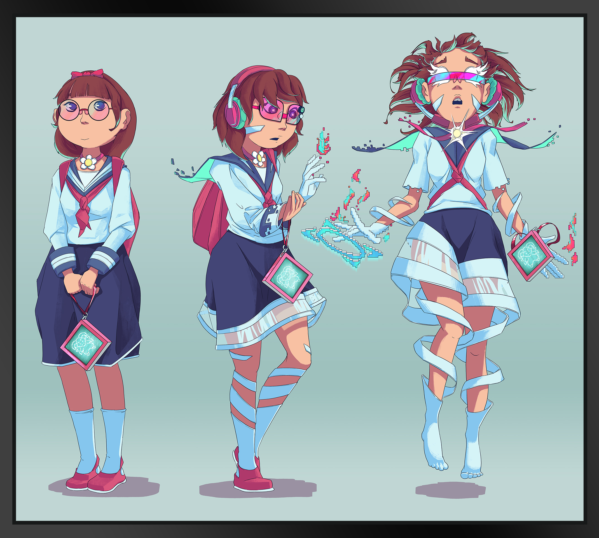
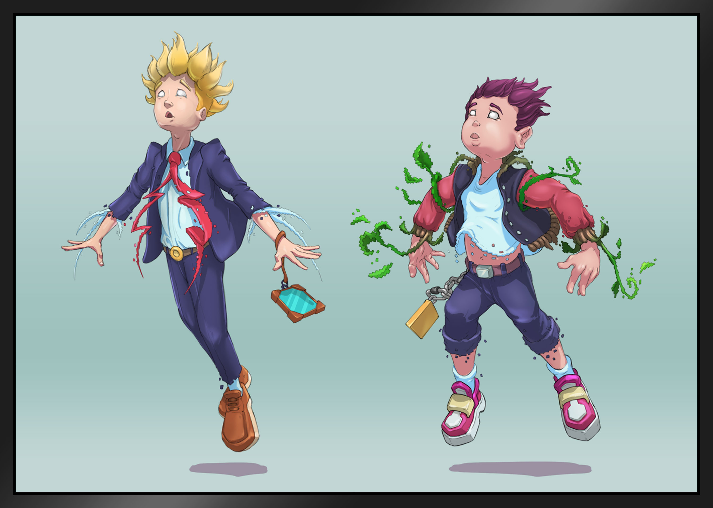

# Player Leveling System

As your monster’s affinity level increases, you will deepen your connection with them as well as with <mark style="color:green;">**Denshi**</mark>. At its core, all Denshi technology is constructed out of building blocks known as <mark style="color:purple;">`$Code`</mark>. As you develop your understanding of <mark style="color:purple;">`$Code`</mark>, you will unlock the ability to control more powerful monsters. Your XP bar will track your knowledge of <mark style="color:purple;">`$Code`</mark> and your skill to maneuver and command it.

This increased ability, however, comes at a certain cost to the user. Just as the console provides a bridge to Denshi, it also establishes a bridge between the monster and the user, providing an avenue for <mark style="color:purple;">`$Code`</mark> to begin to alter the very genetic makeup of the children handling these consoles. The further you develop your knowledge of <mark style="color:purple;">`$Code`</mark>, the greater you adopt your monsters properties, resulting in a personal _**metamorphosis**_. As you immerse yourself further, your own genetic makeup begins to be altered while <mark style="color:purple;">`$Code`</mark> is incorporated bit by bit into your genomic structure. This evolution will appear gradual at first, but will become more manifest as you reach **level cap**. Ultimately, your player will fully evolve into a new human race, a hybrid of human and Denshi genetics, allowing seamless interoperability between players and monsters. This metamorphosis will even give players the ability to assist their monsters in battle with potent and lethal force.

<figure><figcaption></figcaption></figure>
