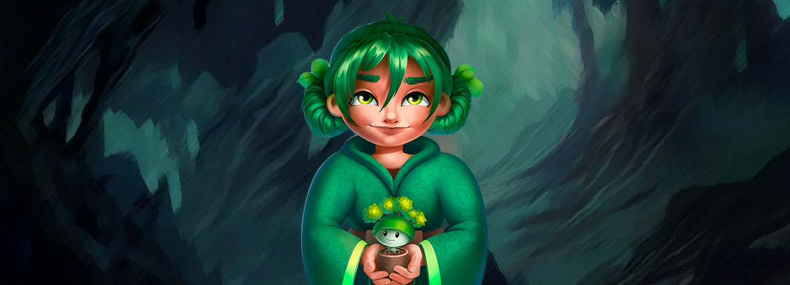

# The Discovery of Denshi



Our story features a prodigy named **Elliot**, age 15, who comes from a long line of inventors. Elliot’s guileless brilliance reveals itself in his extraordinary talent for engineering. This talent has fired his passion for video games. Elliot is driven by a candid belief that video games can help restore our lost connection to our childhood. Elliot’s favorite hobby is disassembling and reassembling video game systems. One day, in the garbage bin at the library, Elliot stumbles upon a strange book authored by an eccentric engineer named **Gustaf Fudnick**. Gustaf's bold ideas have caused him to be branded with the title of conspiracy theorist by mainstream intellectuals, but Elliot believes his theories to be true.&#x20;

In his book, Gustaf describes a secret digital world, established at the beginning of time and written about by ancient civilizations as a parallel universe in which the power of their Gods are bound. These civilizations wrote of the existence of a rare mineral, called _<mark style="color:purple;">**Black Stone**</mark>_, capable of harnessing the energy of the Gods to catapult a bridge from our universe to theirs. For thousands of years, archeologists and geologists had conducted research to analyze and determine the origin of this stone using the newest, state-of-the-art technology, never to discover any trace of energy within it. Gustaf believed that the technology capable of harnessing its power had yet to be invented, and he includes a number of sketches conjecturing what this technology might look like. Elliot becomes obsessed with Gustaf's theories and is committed to fulfilling the inventor’s dream. He manages to obtain this rare stone by purchasing it on <mark style="color:red;">**Genjitsu**</mark>’s black market, accessible only to those familiar with the unregulated dark chain. With the stone safely in his room, Elliot studies Gustaf’s drawings. They are fascinating and puzzling at once. After many experiments and many setbacks, Elliot is finally able to harness the mysterious power of the stone. The device he creates is hardly elegant, and struggles to produce a steady link, but ultimately it is successful in bridging these two worlds and providing proof to all of Gustaf’s theories.&#x20;

After making the connection, Elliot comes into contact with six mysterious women. These women introduce themselves as **The Digital Six**, and claim to be the Architects of a digital world called <mark style="color:green;">**Denshi**</mark>. Each one of them represents an element within their world, which is populated with many different species of creatures, all of which are uniquely linked to its fabric. The Architects tell Elliot of a growing danger within Denshi which threatens the survival of their creatures. <mark style="color:green;">Saku</mark>, _the Architect of Nature_, implores Elliot to protect her own creature by safely hiding him on the console he has created. Elliot sympathizes with the Architects and wishes to help protect as many creatures as he can from the growing threat.

<figure><figcaption></figcaption></figure>

Shortly after this meeting, Elliot builds several more devices in order to house more of the Architects’ beloved creatures, each one tucked away on its own console. Unsure of what their needs may be, Elliot develops software to allow him to interact and care for them. But he finds the task too overwhelming and soon realizes he needs help if he’s to keep these creatures alive in his universe. Elliot invites his five closest friends over to his home (you being one of them) and shares his mysterious discovery. He gives each one of you a console that houses an Architect’s creature. Elliot makes you swear to keep his discovery a secret and impresses upon you the importance of your new responsibility to care for the creature you’ve been entrusted with. Elliot’s friend, **Zuck**, doesn’t appear very impressed with the creature he is allotted. Before leaving Elliot’s house, Zuck says to the group, “_I’m sure I’ll be able to figure out how to power my monster up before all of you losers_”, to which Elliotte replies, “_just don’t forget to FEED it Zuck! And it’s a creature, not a monster…_”.

Several weeks later, in school during lunch period, Elliot notices his friend Zuck handing out square objects to his classmates. Elliot takes a closer look at the gifts and concludes with horror that they are a redesigned version of his console, and that each of them is home to a new creature. Zuck’s friends are thrilled with their new toys and they start battles against each other using these monster creatures. Infuriated, Elliot confronts Zuck, who tells him that all he’s done is just “unlocked some stuff”. He goes on to explain how he convinced his father, **Mr. Berg**, to leverage the resources of his company (MetaToys Inc.) to replicate the technology Elliot created. **MetaToys Inc**. not only succeeded in cloning Elliot's console, but is eager to monetize the consoles by developing a fully functional battle arena for the monsters to battle in against one another. Mr. Berg has made plans to mass produce his new consoles, marketing them to children as battle monsters. Elliot is beside himself at the news of Zuck’s betrayal. Soon after, the Architects share with Elliot that their creatures have begun disappearing from Denshi at an alarming rate. Elliot realizes that Mr. Berg's consoles are responsible for this hastened exodus, and understands that he must do something to stop MetaToys Inc. before it’s too late.


